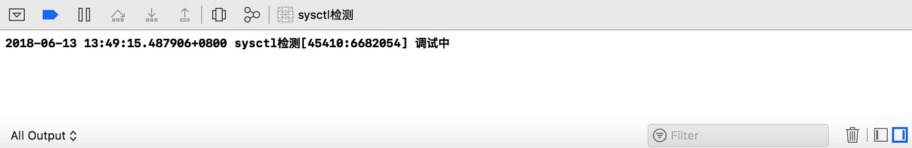

## sysctl检测

sysctl是系统提供的一个函数,用于查询当前进程是否开启了调试状态,这个也可以被我们用作我们的项目是否被人在调试中,如果是在调试中,我们就果断把项目杀死,以做到保护项目安全的目的.

首先我们先定义一个函数,来查询当前进程是否是在调试状态


接下来我们就要开始查询状态咯.

* 首先引入头文件**#import \<sys/sysctl.h\>**
* 具体的函数方法是`int	sysctl(int *, u_int, void *, size_t *, void *, size_t);`

```c
BOOL isDebug() {
    int name[4];
    name[0] = CTL_KERN;                     //操作内核
    name[1] = KERN_PROC;                    //内核的进程查询
    name[2] = KERN_PROC_PID;                //通过pid查询
    name[3] = getpid();                     //获取当前进程的pid
    
    struct kinfo_proc info;
    
    size_t sizeInfo = sizeof(info);         //获取具体的内存大小
    
    int error = sysctl(name, sizeof(name)/sizeof(*name), &info, &sizeInfo, 0, 0);
    
    assert(error == 0);
    
    return ((info.kp_proc.p_flag & P_TRACED) != 0);         //info.kp_proc.p_flag代表的是系统查询状态后的第32位,标识当前进程是否为调试
                                                            //p_traced 是系统提供的宏,与info.kp_proc.p_flag进行与运算来拿到结果
}

```

编写完成后,我们可以直接开始用xcode来运行项目,即可看到相对应的状态


目前只是在viewDidLoad中调用一次,但真正当项目运行起来之后,我们需要每隔一段时间就检测一下,因此就需要Timer来持续检测


大功告成!接下来我们动态调试一下,看看能不能起到防护作用,lldb连接进去之后,就直接闪退掉了,起到了防护作用


> 此时,如果我们是进攻方,又怎么面对这种情况呢?没错,我们是利用facebook的fishhook来对系统函数进行方法交换,在我们自己的方法里进行相关处理后,让进程查询出来的信息一直是非调试状态,我们的目的就达到啦

* 首先记录原始的方法

```c
//原始函数地址
int (*sysctl_p)(int *, u_int, void *, size_t *, void *, size_t);
```

* 书写我们自己的

```c
//我们自己的函数地址
int mySysCtl(int *name, u_int nameLen, void *info, size_t *infoSize, void *newInfo, size_t newInfoSize) {
    if (nameLen == 4 &&
        name[0] == CTL_KERN &&                              //进行条件判断,筛选出是否是进程信息查询
        name[1] == KERN_PROC&&
        name[2] == KERN_PROC_PID&&
        info&&
        (int)*infoSize == sizeof(struct kinfo_proc)
        ) {
        int error = sysctl_p(name,nameLen,info,infoSize,newInfo,newInfoSize);
        struct kinfo_proc *myInfo = (struct kinfo_proc *)info;
        if ((myInfo->kp_proc.p_flag & P_TRACED) != 0) {
            //使用亦或取反
            myInfo->kp_proc.p_flag ^= P_TRACED;
        }
        return error;
    }
    
    return sysctl_p(name,nameLen,info,infoSize,newInfo,newInfoSize);
}

```

* 不要忘了,在+load()方法里,讲两个方法进行交换

```c

+ (void)load {
//    对方法进行交换
    struct rebinding rb;
//    要交换的方法
    rb.name = "sysctl";
//    原始方法
    rb.replacement = sysctl_p;
//    我们自己的方法
    rb.replaced = (void *)&mySysCtl;
    struct rebinding rebindings[] = {rb};
    rebind_symbols(rebindings,1);
    
}
```
接下来我们试试,结果如何呢?

美滋滋的再次可以调试啦😆

> 接下来,我们把我们开始的时候再项目里的注入代码注释掉,将在viewController中的检测代码拿出来,因为在viewcontroller里面才开始检测,时机已经太晚了,我们应该建一个framework包,将它挪到编译的最前面,验证一下用MonkeyDev能不能注入成功能?

此时的状态没法截图我就口述一下,用monkeyDev创建的项目运行起来就闪退,可是自己手动打开app又没问题,接下来我们用ssh登录验证一下能不能打开debugserver呢?

* 我们先查看下demo的进程号

* 利用debugserver开启端口监听

我们可以清晰的看到,当打开debugserver的一瞬间就被断掉了监听,说明我们的防御手段是生效的哦~